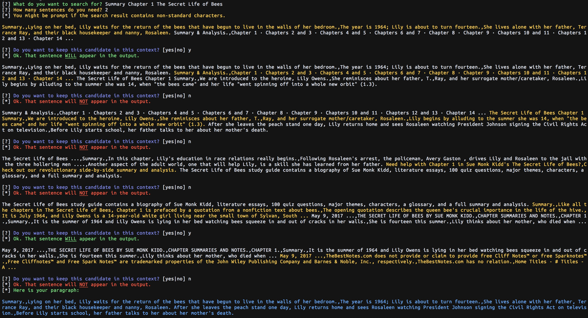

PGoogle
=======

A command line paragraph generator: u give me some keywords, I write ur essay.



## Install

Install using npm:

```bash
npm install -g pgoogle
```

Install using yarn:

```bash
yarn global add pgoogle
```

## Usage

Run the script

```bash
pgoogle
```

Then follow the prompts.
