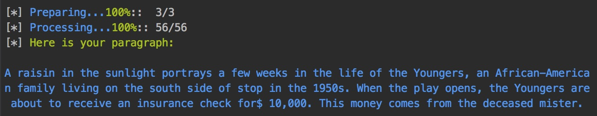

PGoogle
=======

[](https://nodei.co/npm/pgoogle/)

A command line paragraph generator: u give me some keywords, I write ur essay. GPL-3.0 licensed.




**Disclaimer**: This tool is created for research purposes, and is not intended to support
plagiarism or help anyone with their homework. Please be aware of the purpose of using this tool.

    Copyright (C) 2018 Marcus Zhou
    
    This program is free software: you can redistribute it and/or modify
    it under the terms of the GNU General Public License as published by
    the Free Software Foundation, either version 3 of the License, or
    (at your option) any later version.
    
    This program is distributed in the hope that it will be useful,
    but WITHOUT ANY WARRANTY; without even the implied warranty of
    MERCHANTABILITY or FITNESS FOR A PARTICULAR PURPOSE.  See the
    GNU General Public License for more details.
    
    You should have received a copy of the GNU General Public License
    along with this program.  If not, see <http://www.gnu.org/licenses/>.

### Experimental Feature
* From version 1.0.3, pgoogle now supports **Automatic Synonym Replacing (ASP)**. The program will
    pick a synonym from its database and automatically replace it.
* From version 1.0.4, you will be given the option to disable **ASP**.

## Installation

```bash
# With NPM
npm install -g pgoogle

# With YarnPkg
yarn global add pgoogle
```

## Usage

Run `pgoogle`, then follow the prompts. You can run it without any parameters.
The wizard will guide you through the generation process.

```bash
pgoogle
```

### Parameters

```

  Usage: pgoogle [options] [search]

  Options:

    -V, --version        output the version number
    -o, --output [path]  output for the generated document. Pass '-' for stdout.
    -a, --answer         answer all questions with yes
    -f, --false          specify with --answer, answer all the questions with no
    -s, --syn            substitute words with synonyms
    -n, --num [number]   number of sentences to include in the output
    -h, --help           output usage information

```

### Examples for using Parameters

```bash
# The following command tells pgoogle to store the generated paragraph to 'my_paragraph.txt'
pgoogle -o my_paragraph.txt

# This also stores the generated paragraph to 'my_paragraph.txt'
pgoogle > my_paragraph.txt

# Tell pgoogle to search "My Research Topic" and store the generated paragraph in 'my_paragraph.txt'
pgoogle -o my_paragraph.txt "My Research Topic"

# Tell pgoogle to do the search, generate 15 sentences, and store it in 'my_paragraph.txt'
pgoogle -o my_paragraph.txt -n 15 "Another one of my research topics"

# Tell pgoogle to do the search without asking any questions (default answer YES)
pgoogle -n 15 -a "Another one of my research topics"

# Tell pgoogle to do the search without asking any questions (automatically answer NO if '-f' is specified)
pgoogle -n 15 -a -f "Another one of my research topics"
```

### Automatic Synonym Replacing (Experimental)

The program can now select synonyms from the WordNet database, and automatically
replace the words in the original document.
